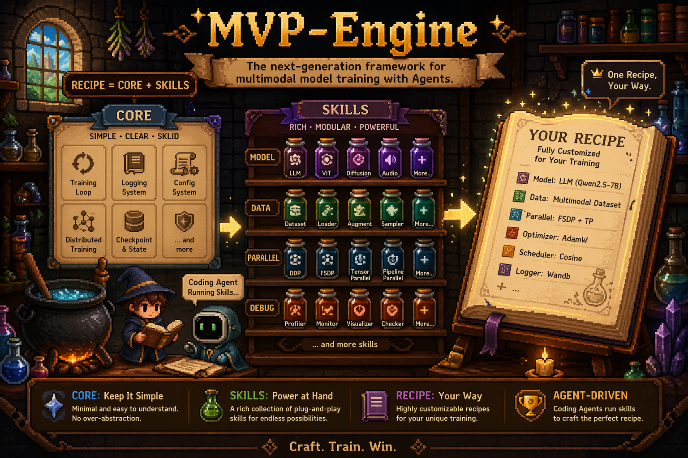

<p align="center">
  <picture>
    <source media="(prefers-color-scheme: dark)" srcset="./assets/banner_2.png">
    <source media="(prefers-color-scheme: light)" srcset="./assets/banner_2.png">
    
  </picture>
</p>

<p align="center">
  <h1 align="center">MVP Engine</h1>
  <p align="center" style="font-weight: bold;">
    The Next-Generation Framework for Multimodal Model Training with Agents
  </p>
  <p align="center">
    by MVP Lab.
  </p>
</p>

## Overview

MVP Engine is a lightweight, extensible training engine for multimodal model research. The core design focuses on separating **experiment logic** (your model, optimizer, scheduler,
data pipeline) from **training orchestration** (loop policy, logging, checkpointing), so you can iterate on multimodal ideas without rewriting boilerplate.

MVP Engine follows an **Agentic** philosophy: the shared `mvp_engine/` package only implements the stable core training runtime, while customization stays in recipes. Instead of over-abstracting custom requirements into the core engine, we provide reusable `skills/` guides. Users can ask a coding AI to run these skills and generate the exact training recipe they need under `recipes/<your_experiment>/`.

## Agentic Workflow

1. Keep the core engine minimal and reusable (`mvp_engine/`).
2. Place task-specific model/data/training logic in `recipes/`.
3. Use a coding AI to execute relevant `skills/` (parallel, model, data, debug, recipe, etc.).
4. Let the AI assemble or modify recipe code/configs for your target training objective.

## Design at a Glance

- **Engine as the orchestration layer**: `mvp_engine/engine/engine.py` defines the base `Engine` class and the
  train workflow (`before_train -> run_train -> after_train`). Subclasses implement `prepare_*` methods and
  the evaluation pipeline.
- **Core-only shared package**: common code in `mvp_engine/` should stay generic, minimal, and stable.
- **Registry-based extensibility**: `ENGINE_REGISTRY` makes it easy to register custom engines and select them
  in config via `engine: YourEngine`.
- **Hydra configuration**: `mvp_engine/launch.py` merges default config with recipe configs and launches the
  requested workflow (`train`, `evaluate`, or custom).
- **Logging system**: metrics are aggregated and dispatched to terminal/file backends; additional backends can
  be added with minimal changes.
- **WebDataset data pipeline**: `mvp_engine/dataset/webdataset.py` provides a resampled shard loader for large
  scale multimodal datasets stored in tar shards.

### Training Workflow

1. **Initialize**: setup parallel, seed, run ID, output directory, and loggers.
2. **Build components**: dataloaders, model, optimizer, scheduler, gradient scaler.
3. **Run loop**: iteration-based training with optional gradient accumulation and mixed precision.
4. **Checkpoint**: periodic and final checkpoints, plus engine state for resuming.

### Project Layout

- `mvp_engine/engine/` — core orchestration logic and Engine base class
- `mvp_engine/utils/` — logging, distributed helpers, training utilities
- `mvp_engine/dataset/` — dataset builders (WebDataset utilities)
- `recipes/` — experiment-specific configs and custom engine/model/data definitions
- `skills/` — reusable agent skills used by coding AI to implement recipe customization patterns
- `outputs/` — run outputs, logs, and checkpoints


## Getting Started

```
mkdir data
cd data
ln -s /mnt/data-alpha-sg-02/team-camera/projects/Potato3D/processed_data/potato_v1 ./

torchrun --nproc_per_node=8 --nnodes=1 --node_rank=0 --master_addr=127.0.0.1 --master_port=12355 -m mvp_engine.launch --config ./recipes/minimal_vlm/configs/train.yaml
```

## Development

```
uv venv --python=3.12
source .venv/bin/activate

# For Dependencies
uv sync
uv pip install https://github.com/Dao-AILab/flash-attention/releases/download/v2.8.3/flash_attn-2.8.3+cu12torch2.9cxx11abiTRUE-cp312-cp312-linux_x86_64.whl

# For Development Tools
uv pip install pre-commit
pre-commit install
```
